# Website TBL — Dokumentasi Teknis Lengkap

**TBL Sofa & Furniture — Digital Store Platform**

---

## Daftar Isi

1. [Ringkasan Proyek](#1-ringkasan-proyek)
2. [Tech Stack](#2-tech-stack)
3. [Arsitektur Sistem](#3-arsitektur-sistem)
4. [Struktur Folder](#4-struktur-folder)
5. [Alur Request](#5-alur-request)
6. [Alur Login Admin](#6-alur-login-admin)
7. [Lapisan Keamanan](#7-lapisan-keamanan)
8. [Alur Data Produk](#8-alur-data-produk)
9. [Alur WhatsApp](#9-alur-whatsapp)
10. [Peta Halaman](#10-peta-halaman)
11. [Skema Database](#11-skema-database)
12. [Routing](#12-routing)
13. [Prioritas MVP](#13-prioritas-mvp)
14. [Kebutuhan Server](#14-kebutuhan-server)
15. [Peran Folder](#15-peran-folder)
16. [File Inti](#16-file-inti)
17. [Kesimpulan](#17-kesimpulan)

---

## 1. Ringkasan Proyek

Website TBL dibangun sebagai **aset digital jangka panjang**, bukan sekadar website profil. Fungsinya menggabungkan **katalog produk + konsultasi WhatsApp + promosi + CMS admin** dalam satu ekosistem.

| Aspek | Keterangan |
|---|---|
| **Nama** | TBL Sofa & Furniture |
| **Jenis** | Digital Store / Company Profile |
| **Acuan Fungsi** | Lovise Sofa |
| **Acuan Visual** | Siantano Furniture |
| **Target** | Skala nasional, profesional, kompetitif |
| **Pendekatan** | PHP Native + SQL, tanpa framework |

### Inti Alur Pengguna

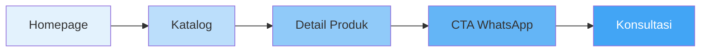

### Inti Alur Admin

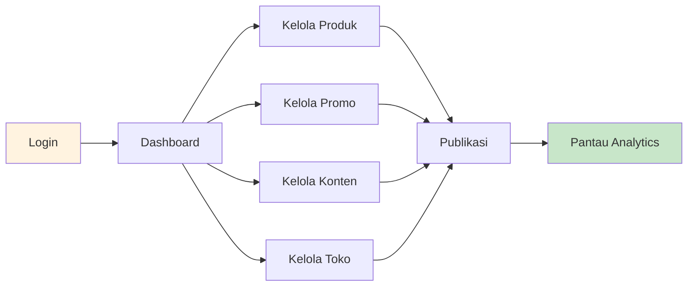

---

## 2. Tech Stack

### Ringkasan

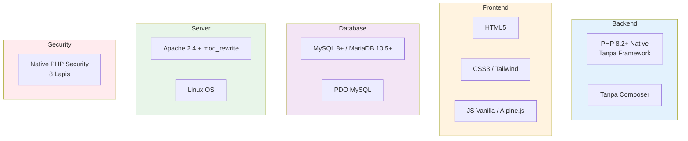

### Detail Tech Stack

| Layer | Teknologi | Versi | Keterangan |
|---|---|---|---|
| Bahasa Backend | PHP Native | 8.2+ | Tanpa framework |
| Dependency Manager | Tidak ada | — | Tanpa Composer |
| Database | MySQL / MariaDB | 8.0+ / 10.5+ | InnoDB, utf8mb4 |
| DB Driver | PDO MySQL | — | Prepared statement only |
| Web Server | Apache | 2.4+ | Dengan mod_rewrite |
| Alternatif Server | Nginx | 1.20+ | Opsional |
| OS Server | Linux | Ubuntu 22.04+ | VPS / Shared Hosting |
| Markup | HTML5 | — | Semantic |
| Styling | CSS3 / Tailwind CSS | 3.x | Opsional |
| Interaksi | JS Vanilla / Alpine.js | ES6+ / 3.x | Ringan |
| Autoload | Custom spl_autoload_register | — | PSR-4 manual |
| Session | PHP Native | — | File-based / DB |
| Password Hashing | Argon2id | — | password_hash() |
| CSRF | Custom Token | — | Per session |
| Routing | Custom Router | — | Regex-based |
| Templating | PHP Native | — | Tanpa Blade/Twig |
| Integrasi | WhatsApp wa.me | — | Deep link |
| SEO | Native meta + sitemap.xml | — | Tanpa library |

### Yang TIDAK Digunakan

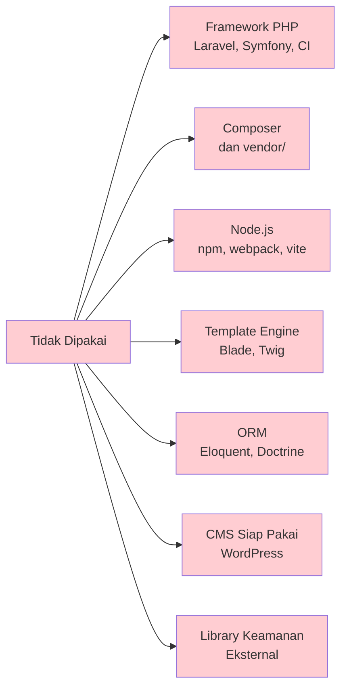

**Alasan:**
- Aman dari supply chain attack
- Ringan, tanpa build tool
- Bisa jalan di shared hosting murah
- Kontrol penuh, mudah diaudit
- Tidak bergantung versi framework

### Perbandingan Alternatif

| Aspek | Stack TBL (Native) | Laravel | WordPress |
|---|---|---|---|
| Berat | Sangat ringan | Berat | Sedang |
| Setup | Upload & jalan | Butuh Composer | Instalasi |
| Keamanan | Full kontrol | Bergantung framework | Bergantung plugin |
| Maintenance | Manual | Update framework | Update core + plugin |
| Hosting | Shared murah | VPS minimum | Shared hosting |
| Kecepatan | Sangat cepat | Sedang | Sedang |
| Cocok untuk | TBL | Proyek besar | Blog/toko |

---

## 3. Arsitektur Sistem

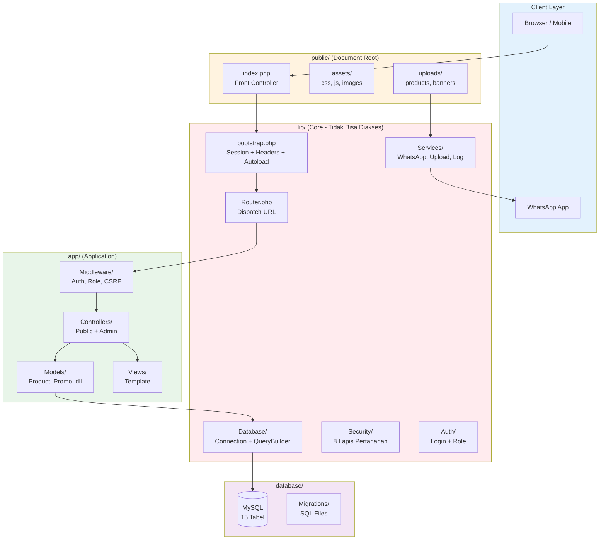

### Penjelasan Lapisan

| Lapisan | Folder | Akses Web | Fungsi |
|---|---|---|---|
| Client | Browser | — | Pengguna akhir |
| Public | public/ | Publik | Document root, aset, upload |
| Core | lib/ | Diblokir | Logic reusable & keamanan |
| App | app/ | Diblokir | Controller, Model, View |
| Data | database/ | Diblokir | Migrasi & seeder |

---

## 4. Struktur Folder

```txt
tbl-website/
│
├── public/                          <- Document Root (WAJIB)
│   ├── index.php                    <- Front Controller
│   ├── .htaccess                    <- Rewrite + Security
│   ├── robots.txt
│   ├── sitemap.xml
│   │
│   ├── assets/
│   │   ├── css/app.css
│   │   ├── js/app.js
│   │   ├── images/logo.png
│   │   └── fonts/
│   │
│   └── uploads/
│       ├── products/
│       ├── banners/
│       ├── categories/
│       └── stores/
│
├── app/                             <- Application Layer
│   ├── Controllers/
│   │   ├── HomeController.php
│   │   ├── ProductController.php
│   │   ├── CategoryController.php
│   │   ├── PromoController.php
│   │   ├── ProfileController.php
│   │   ├── StoreController.php
│   │   ├── InfoController.php
│   │   ├── WhatsAppController.php
│   │   ├── SitemapController.php
│   │   └── Admin/
│   │       ├── AuthController.php
│   │       ├── DashboardController.php
│   │       ├── ProductController.php
│   │       ├── CategoryController.php
│   │       ├── PromoController.php
│   │       ├── ContentController.php
│   │       ├── StoreController.php
│   │       ├── UserController.php
│   │       ├── SettingController.php
│   │       └── BackupController.php
│   │
│   ├── Models/
│   │   ├── BaseModel.php
│   │   ├── Product.php
│   │   ├── ProductImage.php
│   │   ├── Category.php
│   │   ├── Promo.php
│   │   ├── ProductPromo.php
│   │   ├── Content.php
│   │   ├── Store.php
│   │   ├── InfoPage.php
│   │   ├── Setting.php
│   │   ├── User.php
│   │   ├── WhatsAppClick.php
│   │   └── ActivityLog.php
│   │
│   ├── Views/
│   │   ├── layouts/public.php
│   │   ├── layouts/admin.php
│   │   ├── partials/navbar.php
│   │   ├── partials/footer.php
│   │   ├── partials/sidebar.php
│   │   ├── partials/whatsapp-button.php
│   │   ├── errors/404.php
│   │   ├── errors/403.php
│   │   ├── errors/500.php
│   │   ├── home/index.php
│   │   ├── products/index.php
│   │   ├── products/show.php
│   │   ├── categories/show.php
│   │   ├── promos/index.php
│   │   ├── profile/index.php
│   │   ├── store/index.php
│   │   ├── info/show.php
│   │   └── admin/...
│   │
│   └── Middleware/
│       ├── AuthMiddleware.php
│       ├── RoleMiddleware.php
│       └── CsrfMiddleware.php
│
├── lib/                             <- Core Logic (Aman)
│   ├── bootstrap.php
│   │
│   ├── Database/
│   │   ├── Connection.php
│   │   ├── QueryBuilder.php
│   │   ├── Migration.php
│   │   └── Seeder.php
│   │
│   ├── Router/
│   │   ├── Router.php
│   │   └── Route.php
│   │
│   ├── Auth/
│   │   ├── Auth.php
│   │   ├── Hash.php
│   │   └── Role.php
│   │
│   ├── Security/                    <- 8 Lapis Pertahanan
│   │   ├── Csrf.php
│   │   ├── Xss.php
│   │   ├── Sanitizer.php
│   │   ├── Validator.php
│   │   ├── RateLimit.php
│   │   ├── Headers.php
│   │   ├── UploadGuard.php
│   │   └── PasswordPolicy.php
│   │
│   ├── Services/
│   │   ├── WhatsAppService.php
│   │   ├── UploadService.php
│   │   ├── LogService.php
│   │   ├── SeoService.php
│   │   ├── AnalyticsService.php
│   │   └── BackupService.php
│   │
│   ├── Utils/
│   │   ├── Currency.php
│   │   ├── Date.php
│   │   ├── Slug.php
│   │   ├── Image.php
│   │   ├── Pagination.php
│   │   └── Str.php
│   │
│   ├── Constants/
│   │   ├── Routes.php
│   │   ├── Categories.php
│   │   ├── Site.php
│   │   └── WhatsApp.php
│   │
│   ├── Config/
│   │   ├── app.php
│   │   ├── database.php
│   │   ├── security.php
│   │   ├── seo.php
│   │   └── analytics.php
│   │
│   └── Support/
│       ├── Env.php
│       └── Collection.php
│
├── database/
│   ├── migrate.php
│   ├── seed.php
│   ├── schema.sql
│   ├── migrations/
│   │   ├── 001_create_users.sql
│   │   ├── 002_create_categories.sql
│   │   ├── 003_create_products.sql
│   │   ├── 004_create_product_images.sql
│   │   ├── 005_create_promos.sql
│   │   ├── 006_create_product_promos.sql
│   │   ├── 007_create_contents.sql
│   │   ├── 008_create_stores.sql
│   │   ├── 009_create_info_pages.sql
│   │   ├── 010_create_settings.sql
│   │   ├── 011_create_whatsapp_clicks.sql
│   │   ├── 012_create_activity_logs.sql
│   │   ├── 013_create_sessions.sql
│   │   ├── 014_create_login_attempts.sql
│   │   └── 015_create_rate_limits.sql
│   └── seeds/
│       ├── UserSeeder.php
│       ├── CategorySeeder.php
│       ├── ProductSeeder.php
│       ├── ContentSeeder.php
│       ├── SettingSeeder.php
│       └── InfoPageSeeder.php
│
├── routes/
│   ├── web.php
│   └── admin.php
│
├── storage/
│   ├── logs/
│   │   ├── app.log
│   │   ├── security.log
│   │   └── error.log
│   ├── cache/
│   ├── sessions/
│   └── backups/
│
├── tests/
│   ├── Unit/
│   └── Feature/
│
├── .env
├── .env.example
├── .gitignore
├── .htaccess
└── README.md
```

---

## 5. Alur Request

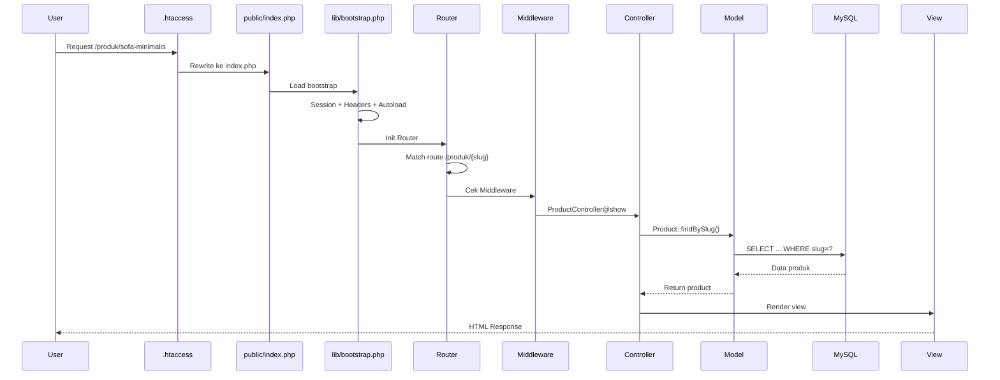

### Ringkasan Tahapan

| Tahap | Proses | File |
|---|---|---|
| 1 | Rewrite URL | public/.htaccess |
| 2 | Load bootstrap | lib/bootstrap.php |
| 3 | Session + Headers | lib/Security/Headers.php |
| 4 | Routing | lib/Router/Router.php |
| 5 | Middleware | app/Middleware/ |
| 6 | Controller | app/Controllers/ |
| 7 | Model | app/Models/ |
| 8 | Query DB | lib/Database/ |
| 9 | Render View | app/Views/ |
| 10 | Response | Ke browser |

---

## 6. Alur Login Admin

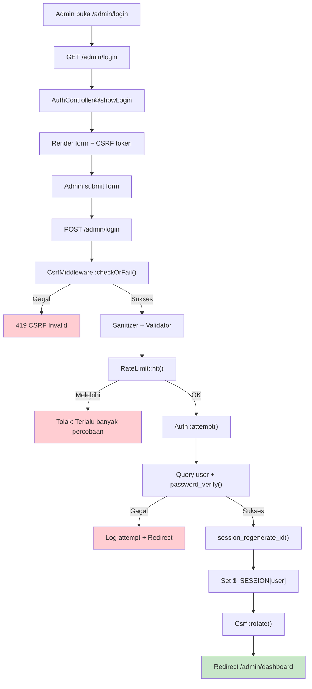

### Aturan Keamanan Login

| Aturan | Nilai | Efek |
|---|---|---|
| Max percobaan | 5x | Lockout 15 menit |
| Panjang password | Min 10 karakter | Validasi |
| Kombinasi | Besar + kecil + angka + simbol | PasswordPolicy |
| Hashing | Argon2id | Anti brute force |
| Session | Regenerate ID | Anti session fixation |
| CSRF | Token per session | Anti CSRF |
| Timeout | 30 menit idle | Auto logout |

---

## 7. Lapisan Keamanan

```mermaid
flowchart LR
    subgraph L1["Lapis 1: Struktur"]
        A1["public/ = document root"]
        A2[".htaccess blokir folder"]
        A3["File inti di luar web"]
    end

    subgraph L2["Lapis 2: Input"]
        B1["Sanitizer::string()"]
        B2["Validator::required()"]
        B3["Whitelist ekstensi"]
    end

    subgraph L3["Lapis 3: Query"]
        C1["PDO Prepared Statement"]
        C2["EMULATE_PREPARES=false"]
        C3["QueryBuilder validasi kolom"]
    end

    subgraph L4["Lapis 4: Output"]
        D1["Xss::e() escape"]
        D2["htmlspecialchars()"]
    end

    subgraph L5["Lapis 5: Session"]
        E1["session_regenerate_id()"]
        E2["HttpOnly + Secure + SameSite"]
        E3["Timeout 30 menit"]
    end

    subgraph L6["Lapis 6: CSRF"]
        F1["Token per session"]
        F2["hash_equals()"]
        F3["Rotate setelah login"]
    end

    subgraph L7["Lapis 7: Rate Limit"]
        G1["Login max 5x"]
        G2["Request max 60/menit"]
        G3["Lockout 15 menit"]
    end

    subgraph L8["Lapis 8: Headers"]
        H1["CSP"]
        H2["X-Frame-Options"]
        H3["HSTS"]
    end

    L1 --> L2 --> L3 --> L4 --> L5 --> L6 --> L7 --> L8

    style L1 fill:#e1f5fe
    style L2 fill:#b3e5fc
    style L3 fill:#81d4fa
    style L4 fill:#4fc3f7
    style L5 fill:#29b6f6
    style L6 fill:#03a9f4
    style L7 fill:#039be5
    style L8 fill:#0288d1,color:#fff
```

### Tabel Mitigasi Ancaman

| Ancaman | Mitigasi | File |
|---|---|---|
| SQL Injection | PDO prepared statement | Connection.php, QueryBuilder.php |
| XSS | Xss::e() untuk semua output | Security/Xss.php |
| CSRF | Token per session | Security/Csrf.php |
| Session Hijacking | session_regenerate_id + cookie hardening | bootstrap.php |
| Brute Force | Rate limit + lockout | Security/RateLimit.php |
| File Upload | Validasi MIME + ekstensi + rename | Security/UploadGuard.php |
| Clickjacking | X-Frame-Options: DENY | Security/Headers.php |
| MIME Sniffing | X-Content-Type-Options: nosniff | Security/Headers.php |
| Info Leak | display_errors = 0 | bootstrap.php |
| Direct Access | Struktur folder + .htaccess | Root .htaccess |
| Supply Chain | Tanpa Composer / dependency | — |

---

## 8. Alur Data Produk

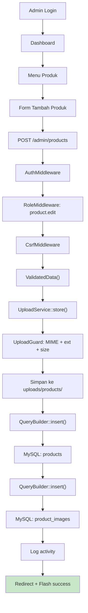

### Validasi Data Produk

| Field | Tipe | Validasi |
|---|---|---|
| name | String | Wajib, max 150 |
| category_id | Integer | Wajib, harus ada |
| price | Decimal | Numeric, min 0 |
| stock | Integer | Min 0 |
| stock_status | Enum | available / out_of_stock / preorder |
| image | File | MIME + ext + size |
| slug | String | Auto-generate, unique |

---

## 9. Alur WhatsApp

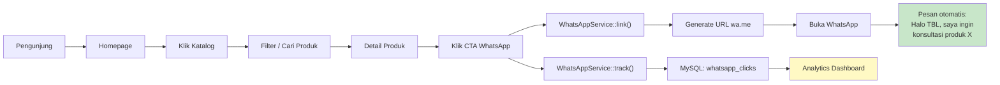

### Format Pesan WhatsApp

```
Halo TBL, saya ingin konsultasi produk {nama_produk}.
{url_produk}
```

Contoh:

```
Halo TBL, saya ingin konsultasi produk Sofa Minimalis 3 Seater.
https://tbl.com/produk/sofa-minimalis-3-seater
```

### Tracking Klik

Setiap klik CTA WhatsApp dicatat di tabel whatsapp_clicks:

- product_id — produk yang dilihat
- page_url — halaman asal
- referrer — sumber traffic
- user_agent — perangkat
- ip_address — lokasi
- clicked_at — waktu klik

---

## 10. Peta Halaman

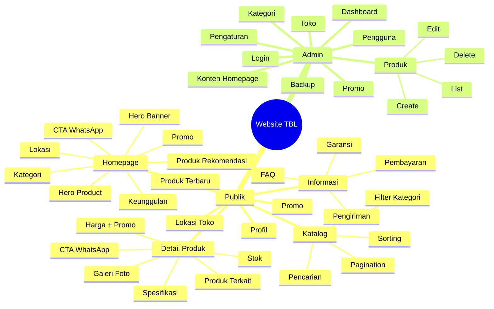

---

## 11. Skema Database

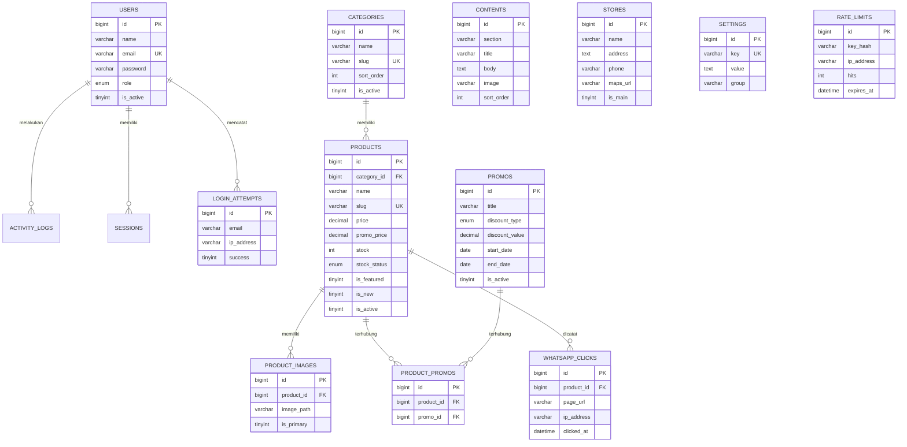

### Daftar 15 Tabel

| No | Tabel | Fungsi |
|---|---|---|
| 1 | users | Admin & editor |
| 2 | categories | Kategori produk |
| 3 | products | Produk TBL |
| 4 | product_images | Galeri foto produk |
| 5 | promos | Promo & diskon |
| 6 | product_promos | Relasi produk - promo |
| 7 | contents | Konten homepage |
| 8 | stores | Lokasi cabang |
| 9 | info_pages | Pengiriman, pembayaran, garansi |
| 10 | settings | Konfigurasi site |
| 11 | whatsapp_clicks | Tracking klik WA |
| 12 | activity_logs | Audit admin |
| 13 | sessions | Session login |
| 14 | login_attempts | Percobaan login |
| 15 | rate_limits | Rate limiting |

---

## 12. Routing

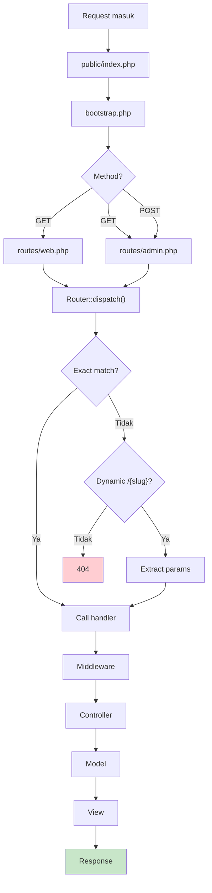

### Route Publik

| Method | URL | Handler |
|---|---|---|
| GET | / | HomeController@index |
| GET | /produk | ProductController@index |
| GET | /produk/{slug} | ProductController@show |
| GET | /kategori/{slug} | ProductController@byCategory |
| GET | /promo | ProductController@promos |
| GET | /profil | HomeController@profile |
| GET | /lokasi | HomeController@store |
| GET | /informasi/{slug} | InfoController@show |

### Route Admin

| Method | URL | Handler |
|---|---|---|
| GET | /admin/login | AuthController@showLogin |
| POST | /admin/login | AuthController@login |
| POST | /admin/logout | AuthController@logout |
| GET | /admin/dashboard | DashboardController@index |
| GET | /admin/products | ProductController@index |
| GET | /admin/products/create | ProductController@create |
| POST | /admin/products | ProductController@store |
| GET | /admin/products/edit/{id} | ProductController@edit |
| POST | /admin/products/update/{id} | ProductController@update |
| POST | /admin/products/delete/{id} | ProductController@destroy |

---

## 13. Prioritas MVP

```mermaid
flowchart LR
    subgraph MVP["MVP - Wajib"]
        A1["Homepage dinamis"]
        A2["Katalog produk"]
        A3["Detail produk"]
        A4["CTA WhatsApp"]
        A5["Dashboard admin"]
        A6["CRUD produk"]
        A7["Manajemen promo"]
        A8["Profil & lokasi toko"]
        A9["Responsive mobile"]
        A10["SEO dasar"]
    end

    subgraph FASE2["Fase 2"]
        B1["Transaksi online"]
        B2["Payment gateway"]
        B3["CRM"]
        B4["Logistik"]
        B5["Multi bahasa"]
        B6["Mobile app"]
        B7["Analytics lanjutan"]
    end

    MVP --> FASE2

    style MVP fill:#c8e6c9
    style FASE2 fill:#bbdefb
```

| Prioritas | Fitur |
|---|---|
| MVP | Homepage, katalog, detail produk, CTA WhatsApp, admin CRUD, promo, profil, responsive, SEO |
| Fase 2 | Transaksi, payment, CRM, logistik, multi bahasa, mobile app |

---

## 14. Kebutuhan Server

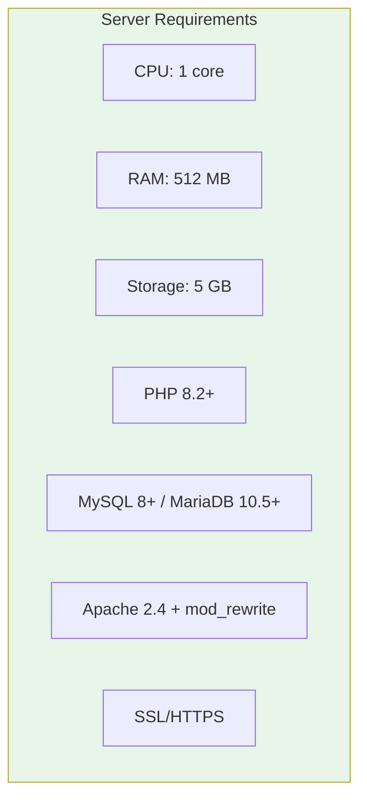

### Spesifikasi

| Komponen | Minimum | Rekomendasi |
|---|---|---|
| CPU | 1 core | 2 core |
| RAM | 512 MB | 2 GB |
| Storage | 5 GB | 20 GB SSD |
| PHP | 8.2 | 8.3 |
| MySQL | 8.0 | 8.0+ |
| Web Server | Apache 2.4 | Apache + Nginx |
| SSL | Let's Encrypt | Let's Encrypt / Cloudflare |

### Ekstensi PHP

| Ekstensi | Fungsi |
|---|---|
| pdo_mysql | Koneksi database |
| mbstring | Handle UTF-8 |
| openssl | Enkripsi & random |
| json | Parsing JSON |
| fileinfo | Deteksi MIME |
| gd / imagick | Optimasi gambar |
| session | Session management |
| filter | Validasi input |
| hash | Hashing password |

### Kompatibilitas Hosting

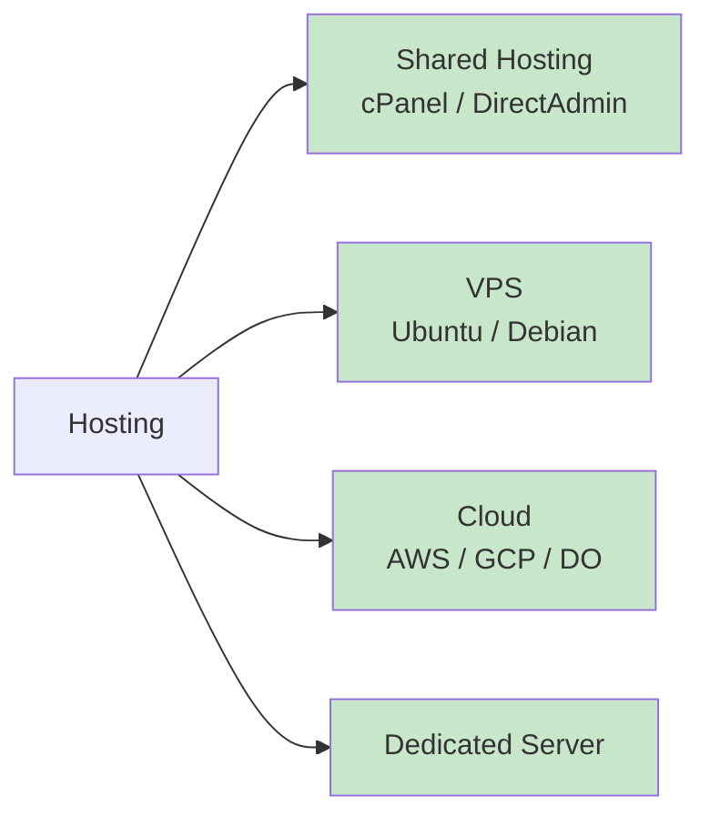

---

## 15. Peran Folder

| Folder | Peran | Akses Web |
|---|---|---|
| public/ | Document root, aset, upload | Publik |
| app/ | Controller, Model, View, Middleware | Diblokir |
| lib/ | Core logic, security, services | Diblokir |
| database/ | Migrasi & seeder | Diblokir |
| routes/ | Definisi route | Diblokir |
| storage/ | Log, cache, backup | Diblokir |
| tests/ | Unit & feature test | Diblokir |
| vendor/ | (Tidak dipakai) | Diblokir |

---

## 16. File Inti

| File | Fungsi |
|---|---|
| public/index.php | Front controller tunggal |
| lib/bootstrap.php | Session + Header + Autoload |
| lib/Router/Router.php | Dispatch URL ke controller |
| lib/Database/Connection.php | PDO aman |
| lib/Database/QueryBuilder.php | Query builder anti SQL injection |
| lib/Security/Csrf.php | Token CSRF |
| lib/Security/Xss.php | Escape output |
| lib/Security/Validator.php | Validasi input |
| lib/Security/RateLimit.php | Batas request |
| lib/Security/Headers.php | Security headers |
| lib/Security/UploadGuard.php | Validasi upload |
| lib/Auth/Auth.php | Login + session |
| lib/Auth/Hash.php | Argon2id |
| lib/Services/WhatsAppService.php | Generate link WA |
| app/Models/BaseModel.php | Base CRUD |
| app/Models/Product.php | Logic produk |
| app/Middleware/AuthMiddleware.php | Proteksi admin |
| app/Middleware/CsrfMiddleware.php | Proteksi POST |

---

## 17. Kesimpulan

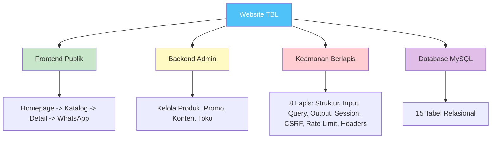

### Poin Utama

| Aspek | Kesimpulan |
|---|---|
| Teknologi | PHP 8.2+ Native + MySQL 8+ |
| Dependency | Tanpa Composer, tanpa Node.js |
| Keamanan | 8 lapis pertahanan native |
| Database | 15 tabel MySQL relasional |
| Struktur | PHP native statis, modular |
| Hosting | Shared hosting murah OK |
| Skalabilitas | Siap ke transaksi, CRM, payment |
| Maintenance | Mudah, tanpa update framework |

### Inti Website

- Publik: Homepage -> Katalog -> Detail Produk -> WhatsApp
- Admin: Login -> Dashboard -> CRUD Produk/Promo/Konten
- Keamanan: 8 lapis pertahanan tanpa dependency eksternal
- Database: 15 tabel MySQL relasional
- Struktur: PHP native statis, aman, ringan, scalable

---

(c) 2026 TBL Sofa & Furniture — Dokumentasi Teknis
