# Website TBL — Dokumentasi Teknis Lengkap

**TBL Sofa & Furniture — Digital Store Platform**

---

## Daftar Isi

1. [Ringkasan Proyek](#1-ringkasan-proyek)
2. [Tech Stack](#2-tech-stack)
3. [Arsitektur Sistem](#3-arsitektur-sistem)
4. [Struktur Folder](#4-struktur-folder)
5. [Alur Request](#5-alur-request)
6. [Alur Login Admin](#6-alur-login-admin)
7. [Lapisan Keamanan](#7-lapisan-keamanan)
8. [Alur Data Produk](#8-alur-data-produk)
9. [Alur WhatsApp](#9-alur-whatsapp)
10. [Peta Halaman](#10-peta-halaman)
11. [Skema Database](#11-skema-database)
12. [Routing](#12-routing)
13. [Prioritas MVP](#13-prioritas-mvp)
14. [Kebutuhan Server](#14-kebutuhan-server)
15. [Peran Folder](#15-peran-folder)
16. [File Inti](#16-file-inti)
17. [Timeline Pengerjaan](#17-timeline-pengerjaan)
18. [Anggaran](#18-anggaran)
19. [Kesimpulan](#19-kesimpulan)

---

## 1. Ringkasan Proyek

Website TBL dibangun sebagai **aset digital jangka panjang**, bukan sekadar website profil. Fungsinya menggabungkan **katalog produk + konsultasi WhatsApp + promosi + CMS admin** dalam satu ekosistem.

| Aspek | Keterangan |
|---|---|
| **Nama** | TBL Sofa & Furniture |
| **Jenis** | Digital Store / Company Profile |
| **Acuan Fungsi** | Lovise Sofa |
| **Acuan Visual** | Siantano Furniture |
| **Target** | Skala nasional, profesional, kompetitif |
| **Pendekatan** | PHP Native + SQL, tanpa framework |

### Inti Alur Pengguna

```mermaid
flowchart LR
    A["Homepage"]:::step
    B["Katalog"]:::step
    C["Detail Produk"]:::step
    D["CTA WhatsApp"]:::step
    E["Konsultasi"]:::end

    A --> B --> C --> D --> E

    classDef step fill:#e3f2fd,stroke:#1565c0,stroke-width:1.5px,color:#0d47a1
    classDef end fill:#c8e6c9,stroke:#2e7d32,stroke-width:1.5px,color:#1b5e20
```

### Inti Alur Admin

```mermaid
flowchart LR
    A["Login"]:::step
    B["Dashboard"]:::step
    C["Kelola Produk"]:::step
    D["Kelola Promo"]:::step
    E["Kelola Konten"]:::step
    F["Kelola Toko"]:::step
    G["Publikasi"]:::step
    H["Pantau Analytics"]:::end

    A --> B
    B --> C --> G
    B --> D --> G
    B --> E --> G
    B --> F --> G
    G --> H

    classDef step fill:#fff3e0,stroke:#ef6c00,stroke-width:1.5px,color:#e65100
    classDef end fill:#c8e6c9,stroke:#2e7d32,stroke-width:1.5px,color:#1b5e20
```

---

## 2. Tech Stack

### Ringkasan

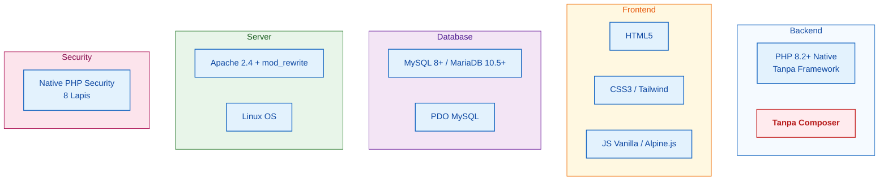

### Detail Tech Stack

| Layer | Teknologi | Versi | Keterangan |
|---|---|---|---|
| Bahasa Backend | PHP Native | 8.2+ | Tanpa framework |
| Dependency Manager | Tidak ada | — | Tanpa Composer |
| Database | MySQL / MariaDB | 8.0+ / 10.5+ | InnoDB, utf8mb4 |
| DB Driver | PDO MySQL | — | Prepared statement only |
| Web Server | Apache | 2.4+ | Dengan mod_rewrite |
| Alternatif Server | Nginx | 1.20+ | Opsional |
| OS Server | Linux | Ubuntu 22.04+ | VPS / Shared Hosting |
| Markup | HTML5 | — | Semantic |
| Styling | CSS3 / Tailwind CSS | 3.x | Opsional |
| Interaksi | JS Vanilla / Alpine.js | ES6+ / 3.x | Ringan |
| Autoload | Custom spl_autoload_register | — | PSR-4 manual |
| Session | PHP Native | — | File-based / DB |
| Password Hashing | Argon2id | — | password_hash() |
| CSRF | Custom Token | — | Per session |
| Routing | Custom Router | — | Regex-based |
| Templating | PHP Native | — | Tanpa Blade/Twig |
| Integrasi | WhatsApp wa.me | — | Deep link |
| SEO | Native meta + sitemap.xml | — | Tanpa library |

### Yang TIDAK Digunakan

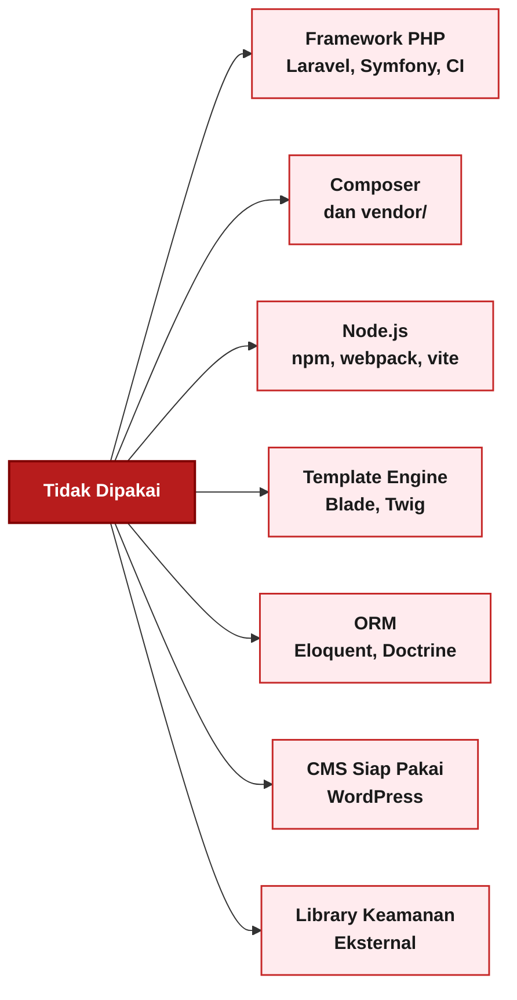

**Alasan:**
- Aman dari supply chain attack
- Ringan, tanpa build tool
- Bisa jalan di shared hosting murah
- Kontrol penuh, mudah diaudit
- Tidak bergantung versi framework

### Perbandingan Alternatif

| Aspek | Stack TBL (Native) | Laravel | WordPress |
|---|---|---|---|
| Berat | Sangat ringan | Berat | Sedang |
| Setup | Upload & jalan | Butuh Composer | Instalasi |
| Keamanan | Full kontrol | Bergantung framework | Bergantung plugin |
| Maintenance | Manual | Update framework | Update core + plugin |
| Hosting | Shared murah | VPS minimum | Shared hosting |
| Kecepatan | Sangat cepat | Sedang | Sedang |
| Cocok untuk | TBL | Proyek besar | Blog/toko |

---

## 3. Arsitektur Sistem

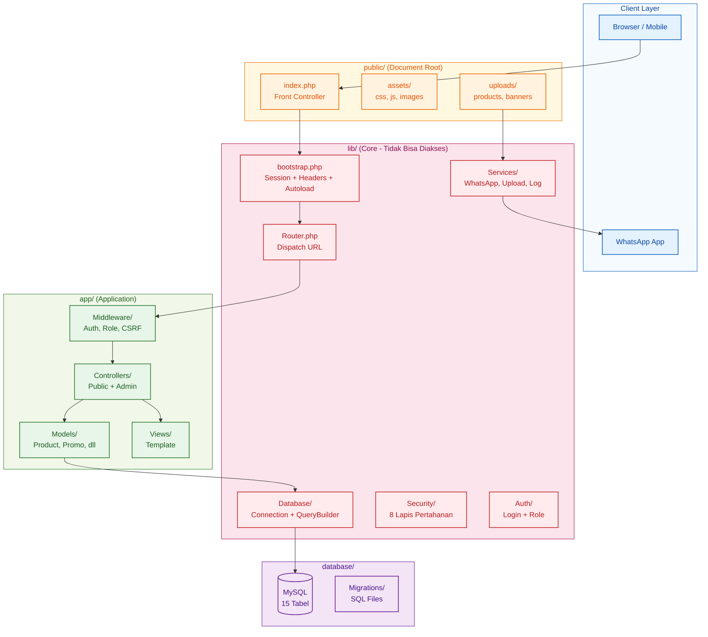

### Penjelasan Lapisan

| Lapisan | Folder | Akses Web | Fungsi |
|---|---|---|---|
| Client | Browser | — | Pengguna akhir |
| Public | public/ | Publik | Document root, aset, upload |
| Core | lib/ | Diblokir | Logic reusable & keamanan |
| App | app/ | Diblokir | Controller, Model, View |
| Data | database/ | Diblokir | Migrasi & seeder |

---

## 4. Struktur Folder

```txt
tbl-website/
│
├── public/                          <- Document Root (WAJIB)
│   ├── index.php                    <- Front Controller
│   ├── .htaccess                    <- Rewrite + Security
│   ├── robots.txt
│   ├── sitemap.xml
│   │
│   ├── assets/
│   │   ├── css/app.css
│   │   ├── js/app.js
│   │   ├── images/logo.png
│   │   └── fonts/
│   │
│   └── uploads/
│       ├── products/
│       ├── banners/
│       ├── categories/
│       └── stores/
│
├── app/
│   ├── Controllers/
│   ├── Models/
│   ├── Views/
│   └── Middleware/
│
├── lib/
│   ├── bootstrap.php
│   ├── Database/
│   ├── Router/
│   ├── Auth/
│   ├── Security/
│   ├── Services/
│   ├── Utils/
│   ├── Constants/
│   ├── Config/
│   └── Support/
│
├── database/
│   ├── migrate.php
│   ├── seed.php
│   ├── schema.sql
│   ├── migrations/
│   └── seeds/
│
├── routes/
│   ├── web.php
│   └── admin.php
│
├── storage/
│   ├── logs/
│   ├── cache/
│   ├── sessions/
│   └── backups/
│
├── tests/
│   ├── Unit/
│   └── Feature/
│
├── .env
├── .env.example
├── .gitignore
├── .htaccess
└── README.md
```

> Detail lengkap tiap folder sudah dijelaskan pada bab sebelumnya.

---

## 5. Alur Request

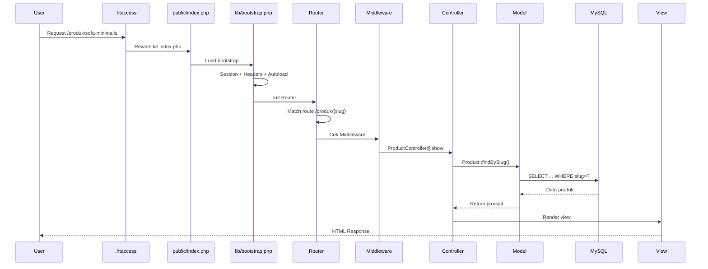

### Ringkasan Tahapan

| Tahap | Proses | File |
|---|---|---|
| 1 | Rewrite URL | public/.htaccess |
| 2 | Load bootstrap | lib/bootstrap.php |
| 3 | Session + Headers | lib/Security/Headers.php |
| 4 | Routing | lib/Router/Router.php |
| 5 | Middleware | app/Middleware/ |
| 6 | Controller | app/Controllers/ |
| 7 | Model | app/Models/ |
| 8 | Query DB | lib/Database/ |
| 9 | Render View | app/Views/ |
| 10 | Response | Ke browser |

---

## 6. Alur Login Admin

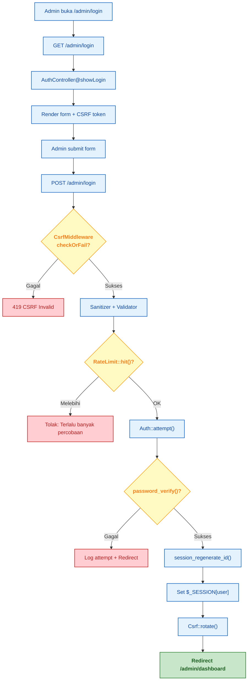

### Aturan Keamanan Login

| Aturan | Nilai | Efek |
|---|---|---|
| Max percobaan | 5x | Lockout 15 menit |
| Panjang password | Min 10 karakter | Validasi |
| Kombinasi | Besar + kecil + angka + simbol | PasswordPolicy |
| Hashing | Argon2id | Anti brute force |
| Session | Regenerate ID | Anti session fixation |
| CSRF | Token per session | Anti CSRF |
| Timeout | 30 menit idle | Auto logout |

---

## 7. Lapisan Keamanan

```mermaid
flowchart LR
    subgraph L1["Lapis 1: Struktur"]
        A1["public/ = document root"]:::layer1
        A2[".htaccess blokir folder"]:::layer1
        A3["File inti di luar web"]:::layer1
    end

    subgraph L2["Lapis 2: Input"]
        B1["Sanitizer::string()"]:::layer2
        B2["Validator::required()"]:::layer2
        B3["Whitelist ekstensi"]:::layer2
    end

    subgraph L3["Lapis 3: Query"]
        C1["PDO Prepared Statement"]:::layer3
        C2["EMULATE_PREPARES=false"]:::layer3
        C3["QueryBuilder validasi kolom"]:::layer3
    end

    subgraph L4["Lapis 4: Output"]
        D1["Xss::e() escape"]:::layer4
        D2["htmlspecialchars()"]:::layer4
    end

    subgraph L5["Lapis 5: Session"]
        E1["session_regenerate_id()"]:::layer5
        E2["HttpOnly + Secure + SameSite"]:::layer5
        E3["Timeout 30 menit"]:::layer5
    end

    subgraph L6["Lapis 6: CSRF"]
        F1["Token per session"]:::layer6
        F2["hash_equals()"]:::layer6
        F3["Rotate setelah login"]:::layer6
    end

    subgraph L7["Lapis 7: Rate Limit"]
        G1["Login max 5x"]:::layer7
        G2["Request max 60/menit"]:::layer7
        G3["Lockout 15 menit"]:::layer7
    end

    subgraph L8["Lapis 8: Headers"]
        H1["CSP"]:::layer8
        H2["X-Frame-Options"]:::layer8
        H3["HSTS"]:::layer8
    end

    L1 --> L2 --> L3 --> L4 --> L5 --> L6 --> L7 --> L8

    classDef layer1 fill:#e1f5fe,stroke:#01579b,stroke-width:1.5px,color:#01579b
    classDef layer2 fill:#b3e5fc,stroke:#0277bd,stroke-width:1.5px,color:#01579b
    classDef layer3 fill:#81d4fa,stroke:#0288d1,stroke-width:1.5px,color:#014f86
    classDef layer4 fill:#4fc3f7,stroke:#039be5,stroke-width:1.5px,color:#013a63
    classDef layer5 fill:#29b6f6,stroke:#03a9f4,stroke-width:1.5px,color:#012a4a
    classDef layer6 fill:#03a9f4,stroke:#0288d1,stroke-width:1.5px,color:#ffffff
    classDef layer7 fill:#039be5,stroke:#0277bd,stroke-width:1.5px,color:#ffffff
    classDef layer8 fill:#0288d1,stroke:#01579b,stroke-width:1.5px,color:#ffffff

    style L1 fill:#f5faff,stroke:#01579b,color:#01579b
    style L2 fill:#f5faff,stroke:#0277bd,color:#01579b
    style L3 fill:#f5faff,stroke:#0288d1,color:#014f86
    style L4 fill:#f5faff,stroke:#039be5,color:#013a63
    style L5 fill:#f5faff,stroke:#03a9f4,color:#012a4a
    style L6 fill:#f5faff,stroke:#0288d1,color:#0288d1
    style L7 fill:#f5faff,stroke:#0277bd,color:#0277bd
    style L8 fill:#f5faff,stroke:#01579b,color:#01579b
```

### Tabel Mitigasi Ancaman

| Ancaman | Mitigasi | File |
|---|---|---|
| SQL Injection | PDO prepared statement | Connection.php, QueryBuilder.php |
| XSS | Xss::e() untuk semua output | Security/Xss.php |
| CSRF | Token per session | Security/Csrf.php |
| Session Hijacking | session_regenerate_id + cookie hardening | bootstrap.php |
| Brute Force | Rate limit + lockout | Security/RateLimit.php |
| File Upload | Validasi MIME + ekstensi + rename | Security/UploadGuard.php |
| Clickjacking | X-Frame-Options: DENY | Security/Headers.php |
| MIME Sniffing | X-Content-Type-Options: nosniff | Security/Headers.php |
| Info Leak | display_errors = 0 | bootstrap.php |
| Direct Access | Struktur folder + .htaccess | Root .htaccess |
| Supply Chain | Tanpa Composer / dependency | — |

---

## 8. Alur Data Produk

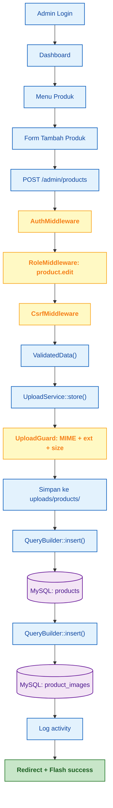

### Validasi Data Produk

| Field | Tipe | Validasi |
|---|---|---|
| name | String | Wajib, max 150 |
| category_id | Integer | Wajib, harus ada |
| price | Decimal | Numeric, min 0 |
| stock | Integer | Min 0 |
| stock_status | Enum | available / out_of_stock / preorder |
| image | File | MIME + ext + size |
| slug | String | Auto-generate, unique |

---

## 9. Alur WhatsApp

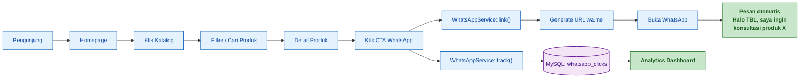

### Format Pesan WhatsApp

```
Halo TBL, saya ingin konsultasi produk {nama_produk}.
{url_produk}
```

### Tracking Klik

| Kolom | Fungsi |
|---|---|
| product_id | Produk yang dilihat |
| page_url | Halaman asal |
| referrer | Sumber traffic |
| user_agent | Perangkat |
| ip_address | Lokasi |
| clicked_at | Waktu klik |

---

## 10. Peta Halaman

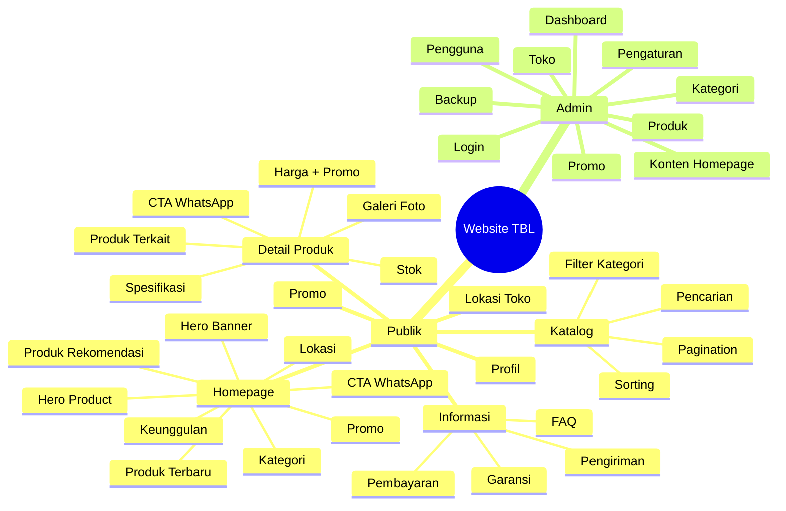

---

## 11. Skema Database

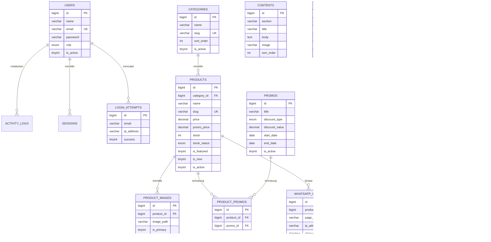

### Daftar 15 Tabel

| No | Tabel | Fungsi |
|---|---|---|
| 1 | users | Admin & editor |
| 2 | categories | Kategori produk |
| 3 | products | Produk TBL |
| 4 | product_images | Galeri foto produk |
| 5 | promos | Promo & diskon |
| 6 | product_promos | Relasi produk - promo |
| 7 | contents | Konten homepage |
| 8 | stores | Lokasi cabang |
| 9 | info_pages | Pengiriman, pembayaran, garansi |
| 10 | settings | Konfigurasi site |
| 11 | whatsapp_clicks | Tracking klik WA |
| 12 | activity_logs | Audit admin |
| 13 | sessions | Session login |
| 14 | login_attempts | Percobaan login |
| 15 | rate_limits | Rate limiting |

---

## 12. Routing

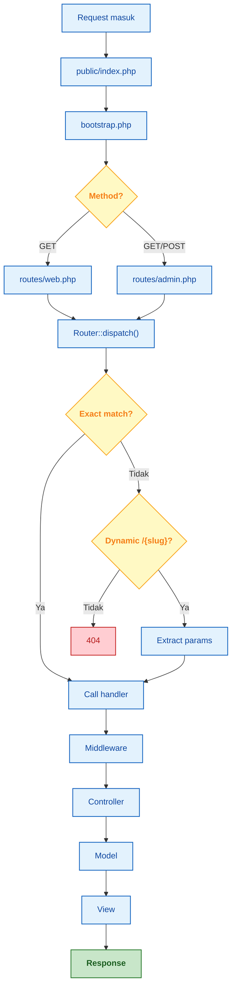

### Route Publik

| Method | URL | Handler |
|---|---|---|
| GET | / | HomeController@index |
| GET | /produk | ProductController@index |
| GET | /produk/{slug} | ProductController@show |
| GET | /kategori/{slug} | ProductController@byCategory |
| GET | /promo | ProductController@promos |
| GET | /profil | HomeController@profile |
| GET | /lokasi | HomeController@store |
| GET | /informasi/{slug} | InfoController@show |

### Route Admin

| Method | URL | Handler |
|---|---|---|
| GET | /admin/login | AuthController@showLogin |
| POST | /admin/login | AuthController@login |
| POST | /admin/logout | AuthController@logout |
| GET | /admin/dashboard | DashboardController@index |
| GET | /admin/products | ProductController@index |
| GET | /admin/products/create | ProductController@create |
| POST | /admin/products | ProductController@store |
| GET | /admin/products/edit/{id} | ProductController@edit |
| POST | /admin/products/update/{id} | ProductController@update |
| POST | /admin/products/delete/{id} | ProductController@destroy |

---

## 13. Prioritas MVP

```mermaid
flowchart LR
    subgraph MVP["MVP - Wajib"]
        A1["Homepage dinamis"]:::mvp
        A2["Katalog produk"]:::mvp
        A3["Detail produk"]:::mvp
        A4["CTA WhatsApp"]:::mvp
        A5["Dashboard admin"]:::mvp
        A6["CRUD produk"]:::mvp
        A7["Manajemen promo"]:::mvp
        A8["Profil & lokasi toko"]:::mvp
        A9["Responsive mobile"]:::mvp
        A10["SEO dasar"]:::mvp
    end

    subgraph FASE2["Fase 2"]
        B1["Transaksi online"]:::next
        B2["Payment gateway"]:::next
        B3["CRM"]:::next
        B4["Logistik"]:::next
        B5["Multi bahasa"]:::next
        B6["Mobile app"]:::next
        B7["Analytics lanjutan"]:::next
    end

    MVP --> FASE2

    classDef mvp fill:#c8e6c9,stroke:#2e7d32,stroke-width:1.5px,color:#1b5e20
    classDef next fill:#bbdefb,stroke:#1565c0,stroke-width:1.5px,color:#0d47a1

    style MVP fill:#f1f8e9,stroke:#2e7d32,color:#1b5e20
    style FASE2 fill:#e3f2fd,stroke:#1565c0,color:#0d47a1
```

---

## 14. Kebutuhan Server

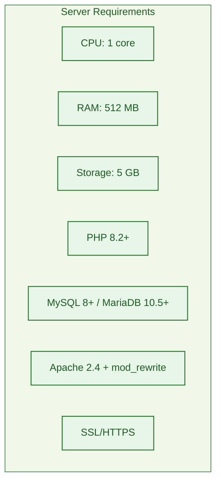

### Spesifikasi

| Komponen | Minimum | Rekomendasi |
|---|---|---|
| CPU | 1 core | 2 core |
| RAM | 512 MB | 2 GB |
| Storage | 5 GB | 20 GB SSD |
| PHP | 8.2 | 8.3 |
| MySQL | 8.0 | 8.0+ |
| Web Server | Apache 2.4 | Apache + Nginx |
| SSL | Let's Encrypt | Let's Encrypt / Cloudflare |

### Ekstensi PHP

| Ekstensi | Fungsi |
|---|---|
| pdo_mysql | Koneksi database |
| mbstring | Handle UTF-8 |
| openssl | Enkripsi & random |
| json | Parsing JSON |
| fileinfo | Deteksi MIME |
| gd / imagick | Optimasi gambar |
| session | Session management |
| filter | Validasi input |
| hash | Hashing password |

---

## 15. Peran Folder

| Folder | Peran | Akses Web |
|---|---|---|
| public/ | Document root, aset, upload | Publik |
| app/ | Controller, Model, View, Middleware | Diblokir |
| lib/ | Core logic, security, services | Diblokir |
| database/ | Migrasi & seeder | Diblokir |
| routes/ | Definisi route | Diblokir |
| storage/ | Log, cache, backup | Diblokir |
| tests/ | Unit & feature test | Diblokir |
| vendor/ | (Tidak dipakai) | Diblokir |

---

## 16. File Inti

| File | Fungsi |
|---|---|
| public/index.php | Front controller tunggal |
| lib/bootstrap.php | Session + Header + Autoload |
| lib/Router/Router.php | Dispatch URL ke controller |
| lib/Database/Connection.php | PDO aman |
| lib/Database/QueryBuilder.php | Query builder anti SQL injection |
| lib/Security/Csrf.php | Token CSRF |
| lib/Security/Xss.php | Escape output |
| lib/Security/Validator.php | Validasi input |
| lib/Security/RateLimit.php | Batas request |
| lib/Security/Headers.php | Security headers |
| lib/Security/UploadGuard.php | Validasi upload |
| lib/Auth/Auth.php | Login + session |
| lib/Auth/Hash.php | Argon2id |
| lib/Services/WhatsAppService.php | Generate link WA |
| app/Models/BaseModel.php | Base CRUD |
| app/Models/Product.php | Logic produk |
| app/Middleware/AuthMiddleware.php | Proteksi admin |
| app/Middleware/CsrfMiddleware.php | Proteksi POST |

---

## 17. Timeline Pengerjaan

### Asumsi

- 1 developer fullstack (PHP native)
- 1 desainer UI/UX (paruh waktu)
- 1 QA (paruh waktu)
- Kerja 5 hari/minggu, 8 jam/hari

### Fase MVP (8 Minggu)

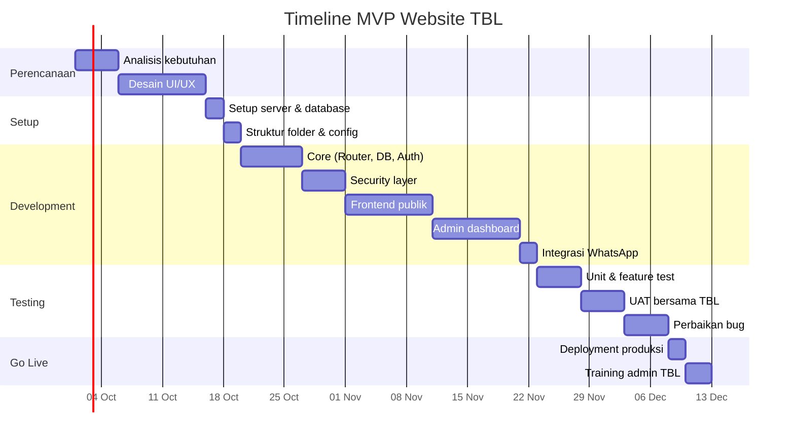

### Rincian Waktu

| Fase | Durasi | Deliverable |
|---|---|---|
| Perencanaan | 2 minggu | Dokumen kebutuhan, desain UI/UX |
| Setup | 1 minggu | Server siap, struktur folder |
| Development Core | 2 minggu | Router, DB, Auth, Security |
| Development Frontend | 2 minggu | Homepage, katalog, detail produk |
| Development Admin | 2 minggu | Dashboard, CRUD produk, promo |
| Testing | 2 minggu | UAT, perbaikan bug |
| Go Live | 1 minggu | Deployment, training |
| **Total** | **8 minggu** | Website live & siap pakai |

---

## 18. Anggaran

> **Catatan:** Estimasi pasar Indonesia 2026, skala UMKM-menengah. Angka dapat berubah sesuai vendor, lokasi, dan kompleksitas.

### 18.1 Ringkasan Anggaran

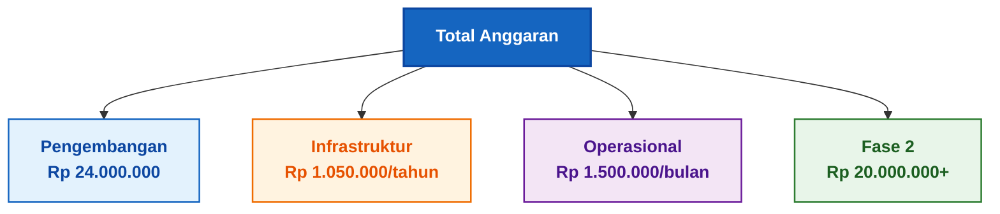

---

### 18.2 Biaya Pengembangan (One-Time)

#### Opsi A: Freelancer / Tim Kecil

| No | Item | Deskripsi | Biaya |
|---|---|---|---|
| 1 | Analisis & Perencanaan | Requirement, user flow, wireframe | Rp 1.500.000 |
| 2 | Desain UI/UX | Mockup homepage, katalog, admin | Rp 3.000.000 |
| 3 | Frontend Development | Homepage, katalog, detail produk | Rp 4.000.000 |
| 4 | Backend Development | Router, DB, Auth, API internal | Rp 6.000.000 |
| 5 | Admin Dashboard | CMS, CRUD produk, promo, konten | Rp 3.500.000 |
| 6 | Security Implementation | 8 lapis keamanan | Rp 2.500.000 |
| 7 | Integrasi WhatsApp | CTA + tracking klik | Rp 500.000 |
| 8 | SEO Setup Dasar | Meta, sitemap, robots.txt | Rp 1.000.000 |
| 9 | Testing & QA | Unit test, UAT, bug fixing | Rp 1.500.000 |
| 10 | Deployment & Training | Setup server, training admin | Rp 500.000 |
| **TOTAL** | | | **Rp 24.000.000** |

#### Opsi B: Agency / Studio

| No | Item | Biaya |
|---|---|---|
| 1 | Paket pengembangan penuh | Rp 45.000.000 – Rp 80.000.000 |
| 2 | Maintenance 1 tahun | Rp 8.000.000 – Rp 15.000.000 |
| **TOTAL** | | **Rp 53.000.000 – Rp 95.000.000** |

#### Opsi C: In-House

| No | Item | Biaya |
|---|---|---|
| 1 | Gaji developer 2 bulan | Rp 16.000.000 – Rp 24.000.000 |
| 2 | Gaji desainer 1 bulan | Rp 5.000.000 – Rp 8.000.000 |
| 3 | Tools & lisensi | Rp 1.000.000 |
| **TOTAL** | | **Rp 22.000.000 – Rp 33.000.000** |

> **Rekomendasi TBL:** Opsi A (Freelancer) — paling efisien untuk scope MVP.

---

### 18.3 Biaya Infrastruktur (Tahunan)

#### Opsi Shared Hosting (Hemat)

| No | Item | Biaya/Tahun |
|---|---|---|
| 1 | Domain .com | Rp 150.000 |
| 2 | Shared Hosting 5 GB | Rp 600.000 |
| 3 | SSL Let's Encrypt | Rp 0 |
| 4 | Backup storage | Rp 300.000 |
| **TOTAL** | | **Rp 1.050.000/tahun** |

#### Opsi VPS (Rekomendasi)

| No | Item | Biaya/Tahun |
|---|---|---|
| 1 | Domain .com | Rp 150.000 |
| 2 | VPS 2 GB RAM | Rp 1.800.000 |
| 3 | SSL Let's Encrypt | Rp 0 |
| 4 | Backup storage | Rp 500.000 |
| 5 | Monitoring (UptimeRobot) | Rp 300.000 |
| **TOTAL** | | **Rp 2.750.000/tahun** |

#### Opsi Cloud (Enterprise)

| No | Item | Biaya/Tahun |
|---|---|---|
| 1 | Domain .com | Rp 150.000 |
| 2 | Cloud VPS (AWS/GCP/DO) | Rp 4.800.000 |
| 3 | SSL Premium | Rp 1.200.000 |
| 4 | CDN (Cloudflare Pro) | Rp 3.000.000 |
| 5 | Backup & monitoring | Rp 1.500.000 |
| **TOTAL** | | **Rp 10.650.000/tahun** |

> **Rekomendasi TBL:** Opsi VPS — keseimbangan harga & performa.

---

### 18.4 Biaya Operasional (Bulanan)

| No | Item | Biaya/Bulan |
|---|---|---|
| 1 | Maintenance & update | Rp 500.000 – Rp 1.000.000 |
| 2 | Update konten (produk/promo) | Rp 300.000 |
| 3 | Security monitoring | Rp 300.000 |
| 4 | Backup verification | Rp 200.000 |
| 5 | Domain & hosting (amortisasi) | Rp 100.000 – Rp 250.000 |
| **TOTAL** | | **Rp 1.400.000 – Rp 2.050.000/bulan** |

---

### 18.5 Biaya Fase 2 (Opsional)

| No | Fitur | Estimasi |
|---|---|---|
| 1 | Payment Gateway (Midtrans/Xendit) | Rp 5.000.000 – Rp 10.000.000 |
| 2 | CRM Integration | Rp 8.000.000 – Rp 15.000.000 |
| 3 | Logistik Integration | Rp 5.000.000 – Rp 10.000.000 |
| 4 | Multi Bahasa | Rp 3.000.000 – Rp 5.000.000 |
| 5 | Mobile App (Android + iOS) | Rp 20.000.000 – Rp 40.000.000 |
| 6 | Analytics Lanjutan | Rp 2.000.000 – Rp 5.000.000 |
| **TOTAL** | | **Rp 43.000.000 – Rp 85.000.000** |

---

### 18.6 Total Anggaran 3 Tahun

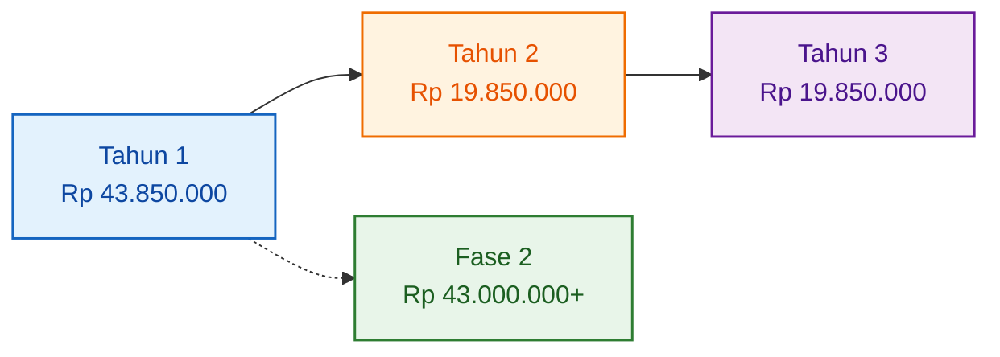

#### Rincian Tahun 1

| Komponen | Biaya |
|---|---|
| Pengembangan (Opsi A) | Rp 24.000.000 |
| Infrastruktur VPS | Rp 2.750.000 |
| Operasional 12 bulan | Rp 16.800.000 |
| **Subtotal Tahun 1** | **Rp 43.550.000** |

#### Rincian Tahun 2 & 3

| Komponen | Biaya/Tahun |
|---|---|
| Infrastruktur VPS | Rp 2.750.000 |
| Operasional 12 bulan | Rp 16.800.000 |
| **Subtotal per Tahun** | **Rp 19.550.000** |

#### Total 3 Tahun

| Tahun | Biaya |
|---|---|
| Tahun 1 | Rp 43.550.000 |
| Tahun 2 | Rp 19.550.000 |
| Tahun 3 | Rp 19.550.000 |
| **TOTAL 3 TAHUN** | **Rp 82.650.000** |

---

### 18.7 Rekomendasi Anggaran TBL

| Prioritas | Alokasi | Keterangan |
|---|---|---|
| **Wajib** | Pengembangan MVP | Rp 24.000.000 |
| **Wajib** | Infrastruktur VPS 1 tahun | Rp 2.750.000 |
| **Wajib** | Operasional 1 tahun | Rp 16.800.000 |
| **Cadangan** | Bug & revisi | Rp 3.000.000 |
| **Total Awal** | | **Rp 46.550.000** |

**Skema Pembayaran yang Disarankan:**

| Termin | Persentase | Nominal | Trigger |
|---|---|---|---|
| DP | 30% | Rp 7.200.000 | Tanda tangan kontrak |
| Termin 2 | 30% | Rp 7.200.000 | Desain & struktur selesai |
| Termin 3 | 30% | Rp 7.200.000 | Development selesai |
| Pelunasan | 10% | Rp 2.400.000 | Go live & training |
| **Total** | **100%** | **Rp 24.000.000** | |

---

### 18.8 ROI (Return on Investment)

Asumsi:

- Rata-rata penjualan via WhatsApp: 20 transaksi/bulan
- Nilai transaksi rata-rata: Rp 3.500.000
- Konversi naik 30% setelah website live
- Margin kotor: 25%

| Bulan | Transaksi | Omzet | Margin |
|---|---|---|---|
| Sebelum website | 20 | Rp 70.000.000 | Rp 17.500.000 |
| Setelah website | 26 | Rp 91.000.000 | Rp 22.750.000 |
| **Kenaikan** | **+6** | **+Rp 21.000.000** | **+Rp 5.250.000/bulan** |

**Break-even:**

| Item | Nilai |
|---|---|
| Total investasi awal | Rp 46.550.000 |
| Kenaikan margin/bulan | Rp 5.250.000 |
| **BEP** | **± 9 bulan** |

---

## 19. Kesimpulan

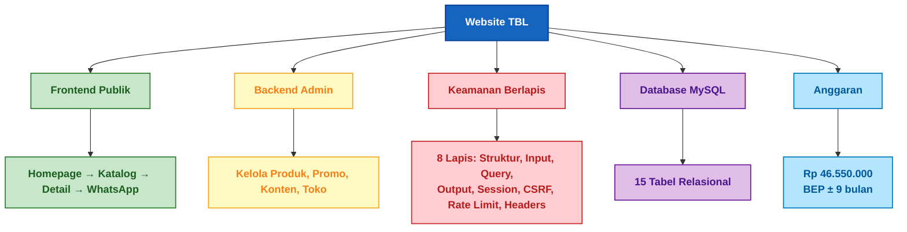

### Poin Utama

| Aspek | Kesimpulan |
|---|---|
| Teknologi | PHP 8.2+ Native + MySQL 8+ |
| Dependency | Tanpa Composer, tanpa Node.js |
| Keamanan | 8 lapis pertahanan native |
| Database | 15 tabel MySQL relasional |
| Hosting | VPS direkomendasikan |
| Skalabilitas | Siap ke transaksi, CRM, payment |
| Maintenance | Mudah, tanpa update framework |
| **Investasi Awal** | **Rp 46.550.000** |
| **Operasional/Bulan** | **Rp 1.400.000 – Rp 2.050.000** |
| **BEP** | **± 9 bulan** |

### Inti Website

- Publik: Homepage → Katalog → Detail Produk → WhatsApp
- Admin: Login → Dashboard → CRUD Produk/Promo/Konten
- Keamanan: 8 lapis pertahanan tanpa dependency eksternal
- Database: 15 tabel MySQL relasional
- Anggaran: Rp 46.550.000 (investasi awal) dengan BEP ± 9 bulan

---

© 2026 TBL Sofa & Furniture Dokumentasi Teknis
